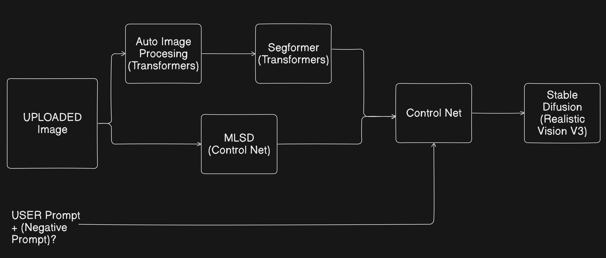

# Int.AI

An interior design AI app made using ControlNet-StableDiffusion model.


https://github.com/user-attachments/assets/27ef984c-1a60-4f0b-afff-ef0dbba8cd3f


## Pipeline Architecture



## Running locally

#### 1. Clone the repository and Navigate to the folder

```sh
git clone https://github.com/Neural-Pirates/Int.AI.git

```
```sh
cd Int.AI
```

#### 2. Create a virtual environment (Optional but Recommended)

It is recommended to create a virtual environment to keep dependencies isolated:
```sh
python -m venv env
```

####  Activate the virtual environment (Only if you create virtual environment)

```sh
# On Windows
.\env\Scripts\activate

# On macOS and Linux
source env/bin/activate
```

#### 3. Install the requirements

```sh
pip install -r requirements.txt
```

#### 4. Run the app

```sh
streamlit run app.py
```

#### Note: The app is currently running the models on `CPU`. If you have a capable `GPU (GTX 1650 or higher)`, change `pipe = pipe.to("cpu")` to `pipe = pipe.to("cuda")` in `src/predictor.py` and setup your pytorch binaries accordingly.

# The Team

- [Swastik Aryal](https://github.com/Swastik-Aryal)
- [James Bhattarai](https://github.com/jamesii-b)

